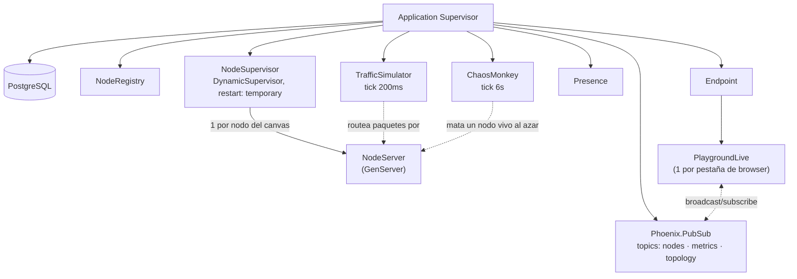

<div align="center">
  <h1>Chaos Playground</h1>
  <p>Armá una topología de infraestructura y sometela a tráfico y fallas reales, en vivo.</p>
  <p>
    <a href="https://chaos-playground.mateopavoni.com.ar"></a>
    
    
  </p>
  <p>
    <strong><a href="https://chaos-playground.mateopavoni.com.ar">🔗 Probar en vivo</a></strong>
    — sin cuenta, sin instalar nada. Al entrar hay una demo guiada de 30s.
  </p>
</div>

## El problema
Los diagramas de arquitectura y las demos de chaos engineering casi siempre son estáticos o
simulados en el cliente. Acá cada nodo del canvas — load balancer, API server, DB, cache, queue —
es un proceso Erlang/OTP real corriendo en el servidor. Matar un nodo desde la UI termina su
proceso de verdad; la supervisión que lo revive (o no) es la de OTP, no una animación.

## Stack
| Tecnología | Por qué |
|---|---|
| Elixir + Phoenix LiveView | UI en tiempo real sin SPA aparte; el estado vive del lado del servidor, cerca de los procesos que representa |
| Erlang/OTP (GenServer, DynamicSupervisor, Registry) | modelo de dominio: cada nodo de red es un proceso supervisado, direccionable por id |
| PostgreSQL + Ecto | persistencia de presets de arquitectura guardados por usuario |
| Tailwind + JS Hook (Canvas/SVG) | panel de control server-driven + animación de partículas de paquetes, que sí necesita JS |

## Features
- Canvas interactivo de nodos y conexiones, con paquetes animados viajando entre ellos (se achican
  solos si el tramo se satura, para que no se vean pegados a RPS alto).
- Motor de tráfico configurable: RPS, latencia por nodo, tasa de fallas, packet loss.
- Chaos actions por nodo/cable: matar proceso, inyectar latencia, dropear paquetes.
- **Chaos Monkey**: toggle que mata un nodo vivo al azar cada 6s, sin intervención — chaos
  engineering en piloto automático.
- Dashboard en vivo: RPS global, latencia p99, tasa de error, con gráfico de las últimas 20s.
- Contador de visitantes conectados al canvas compartido (`Phoenix.Presence`).
- Presets de arquitectura pre-armados (con link directo por `?preset=`) y guardado de topologías
  propias, con cuenta opcional (login sin email, sin fricción de mailer).
- Demo guiada de 30s (botón en el panel de Tráfico) para probar el proyecto sin leer nada — resetea
  el canvas a un estado limpio antes de arrancar, sin importar qué había activado antes.

## Cómo correr
```bash
docker compose up
```
App en http://localhost:4000. Toolchain 100% en Docker (el host no necesita Elixir instalado).
Detalle completo — tests, release, deploy — en [RUN.md](RUN.md).

## Demo
**En vivo:** https://chaos-playground.mateopavoni.com.ar — sin cuenta, sin instalar nada.
Al entrar por primera vez aparece un modal con la opción de correr una demo automática de 30s.

Deployado con [Dokku](https://dokku.com/) (Dockerfile de producción en la raíz del repo,
`mix release` + Postgres vía plugin de dokku, TLS con Let's Encrypt).

## Manual de usuario

1. **Elegí un preset** ("Monolith vs Microservices" o "Primary/Replica DB + Load Balancer") o armá el
   tuyo arrastrando desde un nodo hasta otro para conectarlos.
2. **Tocá "Iniciar"** y subí el slider de RPS objetivo — vas a ver partículas viajando por las
   conexiones y las métricas del header moverse en tiempo real.
3. **Clic en un nodo** para abrir el Inspector: ahí lo matás de verdad ("Matar proceso"), le inyectás
   latencia o packet loss artificial, o lo reiniciás si ya está muerto (un nodo matado se queda
   muerto hasta que lo revivís a mano, a propósito — ver Limitaciones).
4. **Clic en una conexión** para seleccionarla y eliminarla.
5. **Mirá el gráfico del header** (naranja = RPS, rojo punteado = % de error, últimos 20s) — subir el
   failure_rate o matar un nodo con tráfico dependiente tiene que mover esas líneas. Si no se mueven,
   algo dejó de funcionar.

El botón `?` junto al título abre esta misma guía dentro de la app. El botón "Demo guiada (30s)" del
panel de Tráfico corre este recorrido solo, en cualquier momento, y arranca siempre desde cero.

<!-- docs/screenshots/demo.png — capturar el canvas con tráfico corriendo antes de publicar -->

## Architecture

Un nodo = un proceso real, no una fila en memoria — "Matar proceso" llama
`Process.exit(pid, :kill)` sobre el `NodeServer` de verdad. Detalle completo y las decisiones
detrás de cada pieza en [ARCHITECTURE.md](ARCHITECTURE.md).

## Performance
```bash
npx lighthouse https://chaos-playground.mateopavoni.com.ar --only-categories=performance,accessibility,best-practices,seo
```
Sin números fijados acá a propósito — el canvas es un engine compartido en vivo (Chaos Monkey puede
estar corriendo mientras se audita), así que el resultado varía según qué está pasando en el server
en ese momento. Correlo vos mismo para ver el estado actual.

## Limitaciones conocidas
- **El canvas es un único engine global, compartido por todos los visitantes** — no hay aislamiento
  por sesión/usuario. Cargar un preset (propio o built-in) cambia lo que ve todo el mundo conectado,
  logueado o no. Aislar el engine por usuario sería un proyecto aparte.
- **Sin recuperación de contraseña.** El login no envía email (no hay mailer instalado, a propósito
  — un link de recuperación que nunca llega es peor que no ofrecerlo). Quien pierde su contraseña,
  pierde el acceso a sus presets guardados.
- **Un nodo matado no revive solo.** `restart: :temporary` en el `DynamicSupervisor` es intencional
  — la demo muestra el estado roto en vez de taparlo con auto-heal invisible. "Reiniciar nodo" es
  siempre una acción manual.
- **2 tests flaky documentados**, mismo origen (el motor OTP es global, no aislado entre tests):
  uno de carga de presets y uno de pausa de tráfico. Ver `.claude/CLAUDE.md` para el detalle.

## Licencia
Software propietario — todos los derechos reservados. Ver [LICENSE](LICENSE).

## Changelog
| Versión | Fecha | Cambio |
|---------|-------|--------|
| v0.1.0 | 2026-07-20 | Scaffold inicial (Phoenix 1.8 LiveView, Ecto/Postgres, docker-compose de desarrollo) |
| v0.2.0 | 2026-07-20 | Motor OTP: nodos como GenServer supervisados, tráfico simulado con Task concurrente por paquete |
| v0.3.0 | 2026-07-20 | Canvas LiveView con drag-to-connect y partículas animadas, chaos actions, presets built-in + guardados en Postgres, dashboard de métricas |
| v0.4.0 | 2026-07-21 | Identidad visual propia (tema oscuro por default, acento naranja, glow en nodos, transición circular en el toggle de tema), Portfolio Pack |
| v0.5.0 | 2026-07-21 | Deploy productivo (Dokku + Postgres + TLS), gráfico de RPS/error rate en tiempo real, modal de bienvenida + demo guiada automática, ayuda in-app |
| v0.6.0 | 2026-07-29 | Auth con `mix phx.gen.auth` (registro/login, presets guardados por usuario), Chaos Monkey autónomo, contador de visitantes (`Phoenix.Presence`), links directos a preset, fix de ciclos en conexiones y de kill invisible en el canvas compartido |
| v0.6.1 | 2026-07-30 | Fix del toggle de tema en las páginas de auth, demo guiada que resetea el canvas antes de arrancar, tamaño de partículas escalado (log, no lineal) para que se note la diferencia en todo el rango de RPS |
