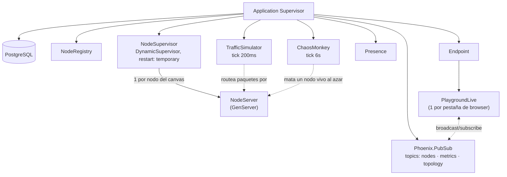

# Chaos Playground

> **Playground de Chaos Engineering y resiliencia de red** (al estilo Gremlin / Chaos Monkey)
> construido alrededor de un problema difícil: **demostrar "let it crash" sin simularlo**, con la
> garantía de que la caída de un nodo es real, no una animación. Cada nodo del canvas — load
> balancer, API server, DB, cache, queue — es un `GenServer` de Erlang/OTP real bajo un
> `DynamicSupervisor`; matar un nodo desde la UI es literalmente `Process.exit(pid, :kill)` sobre
> ese proceso, verificable leyendo el motor OTP, no solo prometido en este README.

[](https://chaos-playground.mateopavoni.com.ar/)


Stack: Elixir + Phoenix LiveView + PostgreSQL + Tailwind, un solo servicio, deployado con **Dokku**.

**Demo:** [`chaos-playground.mateopavoni.com.ar`](https://chaos-playground.mateopavoni.com.ar/) — sin
cuenta, sin instalar nada. Al entrar hay una demo guiada de 30s (botón en el panel de Tráfico) que
arma una topología, genera tráfico y mata un nodo en vivo, sola. Login opcional solo para guardar
tus propias topologías; el canvas y el chaos engineering no lo piden.

### Capturas
| Light | Dark |
|---|---|
|  |  |

---

## ¿Qué resuelve?
Los diagramas de arquitectura y las demos de chaos engineering casi siempre son estáticos o
simulados del lado del cliente: una animación CSS de "paquete viajando" o un mock de "nodo caído"
que solo cambia un ícono. Acá no:

1. **Cada nodo del canvas es un proceso real, supervisado.** Load balancer, API server, DB, cache,
   queue — cada uno es un `GenServer` bajo un `DynamicSupervisor`, direccionable por id vía
   `Registry`. "Matar proceso" en la UI es literalmente `Process.exit(pid, :kill)` sobre ese proceso.
2. **La supervisión es la de OTP, no un mock.** Los hijos del supervisor son `restart: :temporary`
   a propósito: un nodo matado se queda muerto hasta que algo pide levantarlo nuevamente — la demo
   *muestra* el estado roto (para enseñar chaos engineering) en vez de un auto-heal invisible que lo
   tape.
3. **El canvas es un engine global, compartido por todos los visitantes en simultáneo** (no una
   sesión por pestaña) — un trade-off explícito, ver Limitaciones.

## Features
- Canvas interactivo de nodos y conexiones (drag-to-connect), con paquetes animados viajando entre
  ellos — se achican solos (escala logarítmica) si el tramo se satura, para que no se vean pegados
  a RPS alto.
- Motor de tráfico configurable: RPS objetivo, latencia por nodo, tasa de fallas, packet loss.
- Chaos actions por nodo/cable desde un panel Inspector: matar proceso, inyectar latencia, dropear
  paquetes, eliminar una conexión.
- **Chaos Monkey**: toggle que mata un nodo vivo al azar cada 6s, sin intervención — chaos
  engineering en piloto automático.
- Dashboard en vivo: RPS global, latencia p99, tasa de error, con gráfico de las últimas 20s.
- Contador de visitantes conectados al canvas compartido (`Phoenix.Presence`).
- Presets de arquitectura pre-armados (con link directo por `?preset=`) y guardado de topologías
  propias en Postgres, con cuenta opcional.
- Demo guiada de 30s que resetea el canvas a un estado limpio antes de arrancar, sin importar qué
  había activado antes (Chaos Monkey, tráfico corriendo, nodos muertos de otra sesión).

### En números
| | |
|---|---|
| Tests | **101**, `mix test` corriendo en CI/CD contra cada push a `main` |
| Rutas | **7** (canvas + registro/login/settings, sin API JSON aparte — todo LiveView) |
| Motor de tráfico | tick cada **200ms**, un `Task` concurrente por paquete en vuelo |
| Chaos Monkey | tick cada **6s** |
| Lighthouse (demo en vivo) | **97** performance / **89** accesibilidad / **96** best practices — ver [Performance](#performance) |

---

## Arquitectura (resumen)

Detalle completo y las decisiones detrás de cada pieza (por qué `restart: :temporary`, por qué el
engine es global y no por sesión, por qué el context menu se resolvió con click + Inspector) en
[ARCHITECTURE.md](ARCHITECTURE.md).

---

## Cómo correr
```bash
docker compose up
```
App en http://localhost:4000. Toolchain 100% en Docker (imagen `elixir:1.17` + Postgres 16; el host
no necesita Elixir instalado). Detalle completo — release de producción, deploy a Dokku — en
[RUN.md](RUN.md).

## La demo guiada
El botón "Demo guiada (30s)" del panel de Tráfico no es un video ni un script grabado: dispara los
mismos eventos de LiveView que un usuario haría a mano (cargar preset, subir RPS, abrir el Inspector,
matar un nodo, cambiar la entrada de tráfico) contra el engine real, con callouts que explican cada
paso. Primer paso siempre: apaga el Chaos Monkey si estaba prendido y recarga una topología limpia,
así el recorrido es reproducible sin importar qué había antes en el canvas compartido.

## Tests
```bash
docker compose run --rm app mix test
```
101 tests: procesos/concurrencia del motor OTP (estado, kill + cleanup de `Registry`, routing con
`Task`, pausa/resume), LiveView (`Phoenix.LiveViewTest`: mount, start/pause, kill de nodo, cambio de
preset), auth y rate limiting. `async: false` a propósito — el engine es un singleton global, no hay
aislamiento por test. 2 tests son flaky por ese mismo motivo (documentado en `.claude/CLAUDE.md`).

## Limitaciones conocidas
- **El canvas es un único engine global, compartido por todos los visitantes** — no hay aislamiento
  por sesión/usuario. Cargar un preset (propio o built-in) cambia lo que ve todo el mundo conectado,
  logueado o no. Aislar el engine por usuario sería un proyecto aparte.
- **Sin recuperación de contraseña.** El login no envía email (no hay mailer instalado, a propósito
  — un link de recuperación que nunca llega es peor que no ofrecerlo). Quien pierde su contraseña,
  pierde el acceso a sus presets guardados.
- **Un nodo matado no revive solo.** `restart: :temporary` en el `DynamicSupervisor` es intencional
  — la demo muestra el estado roto en vez de taparlo con auto-heal invisible. "Reiniciar nodo" es
  siempre una acción manual.
- **2 tests flaky documentados**, mismo origen (el motor OTP es global, no aislado entre tests): uno
  de carga de presets y uno de pausa de tráfico.

## Licencia
© 2026 Mateo Pavoni. Software propietario, publicado solo con fines de evaluación/portfolio.
Prohibida su copia, redistribución o reuso sin autorización escrita. Ver [LICENSE](LICENSE).
